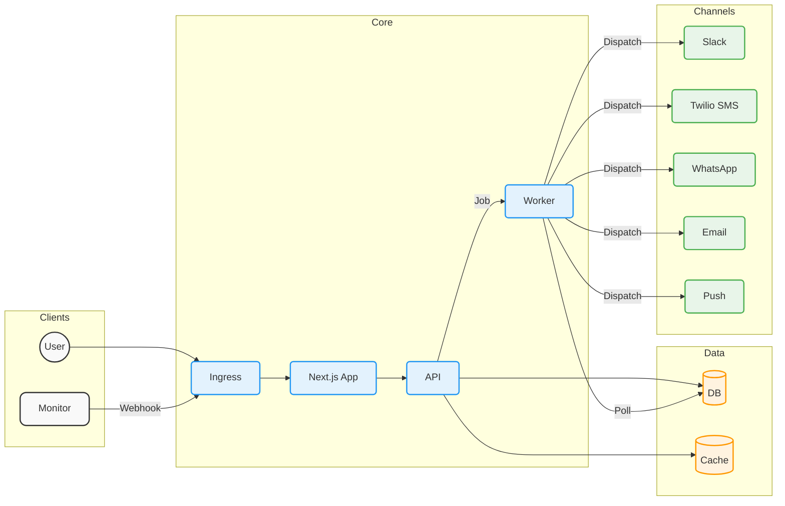

# System Architecture

OpsKnight is designed as a **monolithic Next.js application** for simplicity and performance, backed by robust infrastructure for reliability.

## High-Level Overview

The system runs as a single service (`opsknight-app`) handling both the frontend (React server components) and the backend (API routes, job processing).

### Components

---

## 🏗️ Core Layers

### 1. Application Layer (Next.js)

- **Frontend**: Built with React 19 and Tailwind CSS. Fully server-rendered where possible (RSC) for speed.
- **API**: Next.js API Routes serve as the backend interface for the frontend and external webhooks (Prometheus, Datadog).
- **Worker**: A background polling mechanism (or job queue consumer) running within the node process to handle async tasks like customized escalation timeouts.

### 2. Data Persistence

- **PostgreSQL**: The source of truth for all data (Incidents, Users, Schedules).
- **Prisma**: Type-safe ORM used for all database access.
- **Redis (Optional)**: Used for caching status pages and session storage in high-scale deployments.

### 3. Notification Engine

The engine handles the logic of "Who to notify next?".

1.  **Trigger**: Incident created via Webhook.
2.  **Determine Policy**: Lookout up the Service's Escalation Policy.
3.  **Find On-Call**: Calculate who is currently on-call for that policy step.
4.  **Dispatch**: Send the alert via the user's preferred channel (Slack, SMS, etc.).

## 🔄 Data Flow

1.  **Inbound**: `POST /api/webhooks/prometheus` receives an alert payload.
2.  **Processing**: The API verifies the signature, creates an `Incident` record in Postgres, and enqueues a `ProcessIncident` job.
3.  **Outbound**: The worker picks up the job, resolves the `EscalationPolicy`, and dispatches a notification to the `Channels`.

## 🛡️ Security

- **Authentication**: Usage of NextAuth.js (Auth.js) for secure session management.
- **RBAC**: Role-Based Access Control logic ensures only authorized users can acknowledge or resolve incidents.
- **API Keys**: Service-level API tokens are hashed and validated for ingestion.
