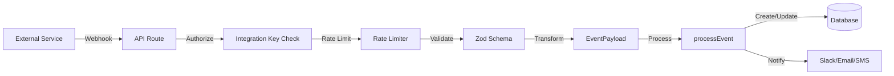

# Integrations End-to-End

This document explains how integrations work in OpsSentinal, from receiving a webhook to creating an incident.

## Overview

OpsSentinal supports 21 external monitoring and alerting services that can send webhooks to automatically create and manage incidents.



---

## Supported Integrations

| Integration             | Endpoint                                    | Signature Verification |
| ----------------------- | ------------------------------------------- | ---------------------- |
| AWS CloudWatch          | `/api/integrations/cloudwatch`              | API Key                |
| Azure Monitor           | `/api/integrations/azure`                   | API Key                |
| Datadog                 | `/api/integrations/datadog`                 | API Key                |
| GitHub/GitLab           | `/api/integrations/github`                  | HMAC SHA-256           |
| Grafana                 | `/api/integrations/grafana`                 | HMAC SHA-256           |
| New Relic               | `/api/integrations/newrelic`                | API Key                |
| Google Cloud Monitoring | `/api/integrations/google-cloud-monitoring` | Optional HMAC          |
| Splunk On-Call          | `/api/integrations/splunk-oncall`           | Optional HMAC          |
| Splunk Observability    | `/api/integrations/splunk-observability`    | Optional HMAC          |
| Dynatrace               | `/api/integrations/dynatrace`               | Optional HMAC          |
| AppDynamics             | `/api/integrations/appdynamics`             | Optional HMAC          |
| Elastic                 | `/api/integrations/elastic`                 | Optional HMAC          |
| Honeycomb               | `/api/integrations/honeycomb`               | Optional HMAC          |
| Bitbucket               | `/api/integrations/bitbucket`               | Optional HMAC          |
| UptimeRobot             | `/api/integrations/uptimerobot`             | Optional HMAC          |
| Pingdom                 | `/api/integrations/pingdom`                 | Optional HMAC          |
| Better Uptime           | `/api/integrations/better-uptime`           | Optional HMAC          |
| Uptime Kuma             | `/api/integrations/uptime-kuma`             | Optional HMAC          |
| Prometheus              | `/api/integrations/prometheus`              | API Key                |
| Sentry                  | `/api/integrations/sentry`                  | HMAC SHA-256           |
| Generic Webhook         | `/api/integrations/webhook`                 | Optional HMAC          |

---

## How It Works

### 1. Receiving the Webhook

Each integration has a dedicated API endpoint:

```
POST /api/integrations/{type}?integrationId={id}
Headers:
  Authorization: Bearer {integration_key}
  Content-Type: application/json
```

### 2. Security Checks

```typescript
// Rate limiting (100 req/min per integration)
const rateResult = checkRateLimit(integrationId);
if (!rateResult.allowed) return 429;

// API key authorization
if (!isIntegrationAuthorized(req, integration.key)) return 401;

// Signature verification (if configured)
if (integration.signatureSecret) {
  if (!verifySignature(payload, signature, secret)) return 401;
}
```

### 3. Payload Validation

All payloads are validated with Zod schemas:

```typescript
const validation = validatePayload(CloudWatchAlarmSchema, body);
if (!validation.success) {
  return jsonError('Invalid payload', 400);
}
```

### 4. Transform to Standard Format

Each integration transforms its payload to a unified `EventPayload`:

```typescript
interface EventPayload {
  event_action: 'trigger' | 'resolve' | 'acknowledge';
  dedup_key: string;
  payload: {
    summary: string;
    source: string;
    severity: 'critical' | 'error' | 'warning' | 'info';
    custom_details?: Record<string, unknown>;
  };
}
```

### 5. Process the Event

The `processEvent` function handles the business logic:

| Action        | Behavior                                           |
| ------------- | -------------------------------------------------- |
| `trigger`     | Creates new incident OR deduplicates with existing |
| `resolve`     | Finds matching incident and resolves it            |
| `acknowledge` | Marks incident as acknowledged                     |

### 6. Downstream Actions

After processing, the system triggers:

- **Slack notifications** (if configured)
- **Email/SMS/Push** (via escalation policy)
- **Status page updates** (if linked)
- **Escalation timers** (if not acknowledged)

---

## Deduplication

Incidents are deduplicated using the `dedup_key`:

```typescript
// Example dedup keys by integration:
'cloudwatch-us-east-1-HighCPU';
'github-workflow-12345';
'prometheus-abc123fingerprint';
```

If an incident with the same `dedup_key` is already OPEN:

- New `trigger` events update the existing incident
- `resolve` events close the existing incident

---

## Configuration

### Creating an Integration

1. Navigate to **Services → Select Service → Integrations**
2. Click **Add Integration**
3. Choose integration type
4. Copy the generated **Integration Key**
5. _(Optional)_ Set a **Signature Secret** for HMAC verification

### Environment Variables

```bash
# Disable signature verification (for testing)
INTEGRATION_VERIFY_SIGNATURES=false

# Disable rate limiting
INTEGRATION_RATE_LIMIT=false
```

---

## Health Monitoring

Check integration health at `/api/integrations/health`:

```json
{
  "status": "healthy",
  "global": {
    "totalReceived": 1523,
    "totalSuccess": 1498,
    "totalErrors": 25,
    "successRate": 98.36,
    "averageLatencyMs": 45.2
  },
  "byType": {
    "CLOUDWATCH": { "successRate": 99.5 },
    "GITHUB": { "successRate": 97.8 }
  }
}
```

---

## Severity Mapping

Each integration maps its native severity to OpsSentinal levels:

| Integration | Critical      | Error | Warning | Info         |
| ----------- | ------------- | ----- | ------- | ------------ |
| CloudWatch  | ALARM         | -     | -       | OK           |
| Azure       | Sev0          | Sev1  | Sev2    | Sev3+        |
| Datadog     | error         | -     | warning | info/success |
| Prometheus  | critical/page | error | warning | -            |
| Sentry      | fatal         | error | warning | info         |

---

## Architecture Diagram

```mermaid
graph TB
    subgraph External["External Services"]
        CW[AWS CloudWatch]
        DD[Datadog]
        GH[GitHub Actions]
        PR[Prometheus]
    end

    subgraph API["API Layer"]
        R1[/cloudwatch/route.ts]
        R2[/datadog/route.ts]
        R3[/github/route.ts]
        R4[/prometheus/route.ts]
    end

    subgraph Security["Security Layer"]
        RL[Rate Limiter]
        SV[Signature Verification]
        ZV[Zod Validation]
    end

    subgraph Transform["Transform Layer"]
        T1[transformCloudWatchToEvent]
        T2[transformDatadogToEvent]
        T3[transformGitHubToEvent]
        T4[transformPrometheusToEvent]
    end

    subgraph Core["Core Processing"]
        PE[processEvent]
        DB[(PostgreSQL)]
    end

    subgraph Notifications["Notifications"]
        SL[Slack]
        EM[Email]
        SM[SMS]
        WH[Webhook]
    end

    CW --> R1
    DD --> R2
    GH --> R3
    PR --> R4

    R1 & R2 & R3 & R4 --> RL --> SV --> ZV

    ZV --> T1 & T2 & T3 & T4
    T1 & T2 & T3 & T4 --> PE
    PE --> DB
    PE --> SL & EM & SM & WH
```

---

## Related Documentation

- [Services](./services.md) - Configure services with integrations

---

## Real World Testing (Localhost)

To test integrations with **real** external services (like GitHub, AWS, Datadog) while running OpsSentinal locally, you need to expose your local server to the internet.

### 1. Expose Localhost via ngrok

Use [ngrok](https://ngrok.com/) to create a secure tunnel:

```bash
# Install ngrok (if not installed)
brew install ngrok/ngrok/ngrok

# Expose port 3000
ngrok http 3000
```

Copy the HTTPS URL generated by ngrok (e.g., `https://a1b2-c3d4.ngrok-free.app`).

### 2. Configure the External Service

For example, to test **GitHub**:

1.  Go to your GitHub Repository Settings → **Webhooks**.
2.  Click **Add webhook**.
3.  **Payload URL**: `{NGROK_URL}/api/integrations/github?integrationId={YOUR_INTEGRATION_ID}`
4.  **Content type**: `application/json`
5.  **Secret**: _(Optional) Set this if you configured `signatureSecret` in OpsSentinal_
6.  **Which events?**: Select "Workflow runs" or "Pushes".
7.  Click **Add webhook**.

### 3. Trigger an Event

1.  Trigger the event in the external service (e.g., push code to GitHub).
2.  Watch your local OpsSentinal logs (`npm run dev` terminal).
3.  Check `http://localhost:3000/incidents` to see the new incident!

> **Note:** The integration must be `enabled` and have a valid `signatureSecret` (if configured on the external service).
