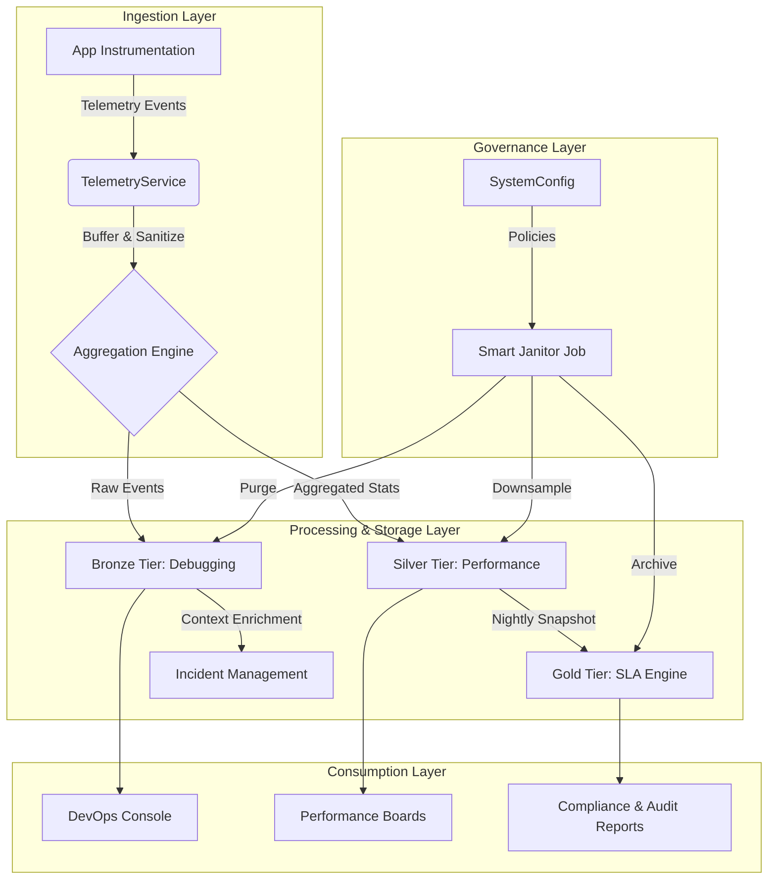

# Enterprise Incident Management & Observability Architecture

## 1. Executive Summary

This document defines the reference architecture for the **OpsSentinel Enterprise Observability Engine**. The system provides a unified platform for Incident Management and Telemetry, unified by a **Value-Based Tiered Architecture**.

**Core Philosophy**: "Not all data is equal."

- **Operational Noise** is ephemeral and costly.
- **Business Signals** are permanent and invaluable.

We utilize a **Gold / Silver / Bronze** tiering model to balance infinite retention for compliance (Gold) with cost-effective debugging for engineering (Bronze).

---

## 2. Logical Architecture



---

## 3. The Tiered Data Model

We utilize PostgreSQL for all tiers, leveraging its reliability and relational capabilities to link Observability directly to Incidents.

### 🥇 Gold Tier: SLA & Business Compliance

**Purpose**: Immutable "Source of Truth" for audit, compliance, and executive reporting.
**Retention**: Infinite (Years).
**Resolution**: Daily Snapshots.

#### Data Model (Prisma)

```prisma
// Defined once, versioned forever.
model SLADefinition {
  id          String   @id @default(cuid())
  serviceId   String
  version     Int      @default(1)
  target      Float    // e.g., 99.9
  window      String   // "30d", "quarterly"
  metricType  String   // "UPTIME", "LATENCY_P99"
  activeFrom  DateTime
  activeTo    DateTime? // Null means current

  snapshots   SLASnapshot[]
}

// The Frozen Truth. Calculated nightly.
model SLASnapshot {
  id              String   @id @default(cuid())
  date            DateTime // The day this represents
  slaDefinitionId String

  // The actuals
  totalEvents     Int
  errorEvents     Int
  uptimePercentage Float
  breachCount     Int
  errorBudgetBurn Float

  // Link to evidence (optional Silver tier references)
  evidence        Json?

  @@unique([date, slaDefinitionId])
}
```

### 🥈 Silver Tier: Performance Trends

**Purpose**: Capacity planning, regression detection, "Month-over-Month" analysis.
**Retention**: Configurable (Default: 90 Days).
**Resolution**: Hourly Aggregates.

#### Data Model (Prisma)

```prisma
model MetricRollup {
  id        String   @id @default(cuid())
  bucket    DateTime // Truncated to Hour/Minute
  serviceId String
  name      String   // "http_request_duration"

  // Dimensions
  tags      Json     // { "route": "/api/users", "method": "GET" }

  // Pre-computed Stats (No re-calculation needed)
  count     Int
  sum       Float
  min       Float
  max       Float
  p50       Float
  p90       Float
  p99       Float

  @@index([serviceId, bucket])
}
```

### 🥉 Bronze Tier: Incident Debugging

**Purpose**: Real-time "Why is it broken now?" troubleshooting.
**Retention**: Short-term (Default: 3-7 Days).
**Resolution**: Raw Event Data with PII Redaction.

#### Data Model (Prisma)

```prisma
model LogEntry {
  id        String   @id @default(cuid())
  timestamp DateTime @default(now())
  serviceId String
  level     String   // ERROR, WARN, INFO

  message   String
  context   Json?    // Stack trace, query params (Sanitized)
  traceId   String?  // For distributed tracing
  userId    String?  // Encrypted/Hashed for privacy

  @@index([serviceId, timestamp])
  @@index([traceId])
}
```

---

## 4. The Intelligence Engines

### A. The Telemetry Ingestion Engine

Located in `src/services/telemetry`.

- **Responsibility**: Receive high-velocity data, separate signal from noise.
- **Logic**:
  1.  **Buffer**: Accumulate 1 second of data in memory.
  2.  **Route**:
      - Is it an ERROR or HIGH LATENCY? -> Write to **Bronze**.
      - Identify Metric (Duration, Count)? -> Update In-Memory Histogram for **Silver**.
  3.  **Flush**: Every 60s, write Silver aggregates to DB.

### B. The SLA Engine (Gold Tier Generator)

Located in `src/workers/sla-engine`.

- **Responsibility**: Convert Silver/Bronze data into Gold immutable records.
- **Schedule**: Nightly (00:00 UTC).
- **Logic**:
  1.  Load active `SLADefinition` for each service.
  2.  Query `MetricRollup` (Silver) for the previous 24h.
  3.  Calculate Uptime/Breaches based on the Definition.
  4.  Insert into `SLASnapshot`.
  5.  **Audit**: Log "Snapshot created for {Service} - 99.95%".

### C. The Smart Janitor (Governance)

Located in `src/workers/governance`.

- **Responsibility**: Enforce cost and compliance rules.
- **Logic**:
  1.  **Read Config**: Fetch `SystemConfig.retention_policy`.
  2.  **Purge Bronze**: `DELETE FROM LogEntry WHERE age > 7 days`.
  3.  **Compensate Silver**: `DELETE FROM MetricRollup WHERE granularity='minute' AND age > 30 days`. (Keep hourly).
  4.  **Protect Gold**: _Never delete_.
  5.  **Cardinality Check**: Alert admins if `MetricRollup` unique tag combinations exceed 10,000.

---

## 5. Incident Integration Model

Observability is not passive; it drives Incident Management.

### Detection & Triage

1.  **SLA Burn Alert**: TelemetryService detects error rate > Silver Threshold.
2.  **Auto-Incident**: System creates `Incident` record.
3.  **Enrichment**:
    - Attach **Silver** Trend Graph (Last 24h vs Last Week).
    - Attach Sample **Bronze** Logs (Top 5 recent errors).

### Resolution & Post-Mortem

1.  **Resolution**: Responder closes Incident.
2.  **SLA Impact**:
    - Incident duration is recorded.
    - `SLASnapshot` for that day includes the "Downtime Minutes" from the Incident.
3.  **Evidence**: The specific Bronze logs linked to the Incident are **exempted** from the Janitor purge (promoted to "Incident Evidence" retention).

---

## 6. Execution Plan & Phasing

### Phase 1: Foundation (The Plumber)

- [ ] Implement Prisma Schemas (All Tiers + SystemConfig).
- [ ] Build `TelemetryService` (Ingestion & Bronze/Silver routing).
- [ ] Build `RetentionJanitor` (Basic cleanup).

### Phase 2: The Value Layer (The Accountant)

- [ ] Implement `SLADefinition` management.
- [ ] Build `SLAEngine` (Nightly snapshot jobs).
- [ ] Create "SLA Report" UI using Gold data.

### Phase 3: Integration (The Commander)

- [ ] Connect Telemetry Alerts -> Incident Creation.
- [ ] Show Silver/Bronze data in Incident Console.
