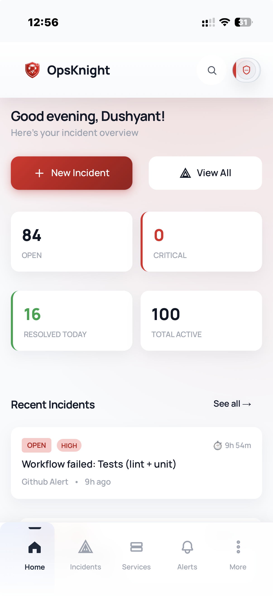
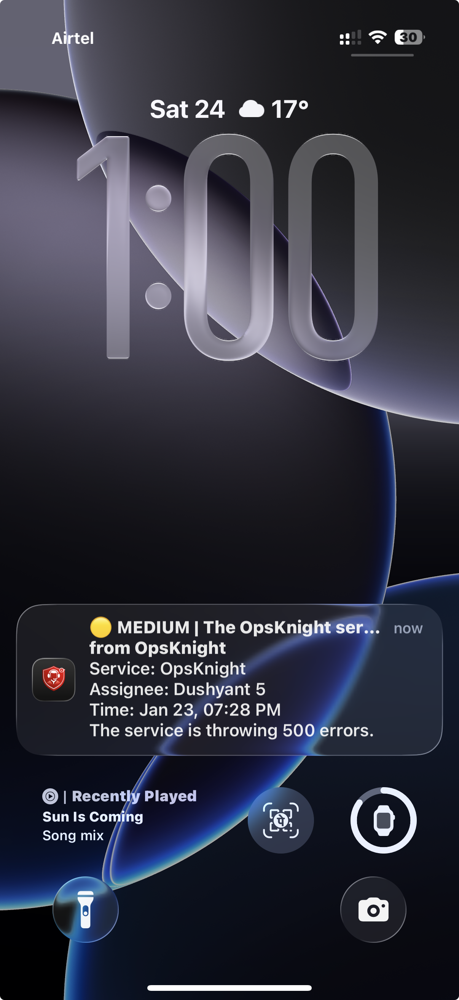

# Mobile Access

OpsKnight provides a full-featured mobile experience through a Progressive Web App (PWA). Handle incidents, check schedules, and respond to alerts from anywhere.

Start here: **[Mobile Setup](./setup)** — install the PWA and enable push notifications.

**Built for on-call in the real world**
- Installable PWA on iOS, Android, and desktop
- Fast, touch-first UI for incident response
- Push notifications with rich incident context

---

## Why PWA?

A Progressive Web App provides the best of both worlds:

| Feature | PWA | Native App |
|---------|-----|------------|
| **Installation** | Instant from browser | App store review |
| **Updates** | Automatic | Manual update |
| **Push Notifications** | Yes | Yes |
| **Offline Support** | Basic | Full |
| **Cross-Platform** | iOS + Android + Desktop | Separate codebases |
| **Development** | Single codebase | Multiple codebases |

---

## Installing the PWA

### On iOS (Safari)

1. Open OpsKnight in Safari
2. Tap the **Share** button (square with arrow)
3. Scroll down and tap **Add to Home Screen**
4. Tap **Add**

<!-- placeholder:ios-install -->
<!-- Add: Screenshot showing iOS Safari "Add to Home Screen" option -->

### On Android (Chrome)

1. Open OpsKnight in Chrome
2. Tap the **three-dot menu**
3. Tap **Add to Home Screen** or **Install App**
4. Tap **Install**

<!-- placeholder:android-install -->
<!-- Add: Screenshot showing Android Chrome install prompt -->

### On Desktop (Chrome/Edge)

1. Open OpsKnight in browser
2. Click the **install icon** in the address bar
3. Click **Install**

---

## Mobile Features

### Dashboard

The mobile dashboard provides a quick overview:

- **System Status** — Current operational state
- **Open Incidents** — Count and urgency breakdown
- **Your Queue** — Incidents assigned to you
- **On-Call Status** — Who's currently on-call

### Incident Management

Handle incidents with touch-optimized controls:

- **View Incidents** — List with filtering by status/urgency
- **Quick Actions** — Acknowledge, Resolve buttons
- **Incident Detail** — Full timeline, notes, context
- **Add Notes** — Comment on incidents
- **Reassign** — Change assignee (user or team)

### On-Call Schedules

Check your on-call schedule:

- **Current On-Call** — See who's on-call now
- **Schedule Timeline** — Visual view of rotations
- **Your Shifts** — Upcoming on-call periods
- **Overrides** — View and create overrides

### Notifications

Receive push notifications for:

- **New Incidents** — When assigned or on-call
- **Escalations** — When incident escalates to you
- **Updates** — When incidents you're watching change

---

## Push Notifications

### Enabling Push Notifications

1. Install the PWA (recommended for best experience)
2. When prompted, tap **Allow** for notifications
3. Verify in **Profile** → **Devices** that your device appears
4. Ask your admin to enable **Push** in Settings → Notification Providers

<!-- placeholder:push-permission -->
<!-- Add: Screenshot of push notification permission dialog -->

### Notification Types

| Notification | When |
|--------------|------|
| **Incident Triggered** | You're on-call or assigned |
| **Incident Escalated** | Escalation reached your step |
| **SLA Breach Warning** | SLA about to breach |
| **Incident Resolved** | Incident you're watching resolved |

### Managing Notifications

Control what notifications you receive:

1. Go to **Profile** → **Notification Preferences**
2. Enable/disable channels:
   - Push notifications
   - SMS (requires phone number)
   - Email
3. Set **Quiet Hours** to silence during sleep

---

## Mobile Navigation

The mobile interface uses a bottom navigation bar:

| Icon | Page | Function |
|------|------|----------|
| **Home** | Dashboard | Overview and quick access |
| **Incidents** | Incident List | View and manage incidents |
| **Schedules** | Schedules | On-call rotations |
| **More** | Menu | Additional features |

### More Menu

Access additional features:

- **Services** — Service directory
- **Teams** — Team management
- **Policies** — Escalation policies
- **Analytics** — Metrics and reports
- **Settings** — User preferences
- **Profile** — Account settings

---

## Offline Support

The PWA provides basic offline functionality:

| Feature | Offline Behavior |
|---------|------------------|
| **View cached incidents** | Yes |
| **View cached schedules** | Yes |
| **Acknowledge** | Queued, syncs when online |
| **Add notes** | Queued, syncs when online |
| **Create incident** | Requires connection |

> **Note**: Push notifications require an internet connection.

---

## Mobile-Specific UI

### Touch Targets

All interactive elements are sized for touch:

- **Buttons**: Minimum 44px tap target
- **List items**: Full-width tap area
- **Checkboxes**: Enlarged for touch

### Swipe Gestures

Some views support swipe gestures:

- **Pull to refresh** — Update incident list
- **Swipe to action** — Quick acknowledge/resolve (where enabled)

### Responsive Layout

The UI adapts to different screen sizes:

- **Phone (< 640px)** — Single-column layout
- **Tablet (640-1024px)** — Two-column where appropriate
- **Desktop (> 1024px)** — Full desktop experience

---

## Troubleshooting

### Push Notifications Not Working

1. **Check permission** — Ensure notifications are allowed in browser/OS settings
2. **Check device registration** — Verify in Profile → Devices
3. **Check quiet hours** — Make sure you're not in quiet hours
4. **Reinstall PWA** — Remove and re-add to home screen

### PWA Not Installing

1. **Use Safari (iOS)** — Chrome on iOS can't install PWAs
2. **Check HTTPS** — PWAs require HTTPS
3. **Clear cache** — Try clearing browser data
4. **Check manifest** — Verify service worker is loading

### Slow Performance

1. **Check connection** — PWA needs good connectivity
2. **Clear cache** — Remove and reinstall PWA
3. **Check device** — Older devices may be slower
4. **Reduce data** — Filter incident lists to smaller sets

---

## Best Practices

### For Responders

- **Install the PWA** — Better experience than browser
- **Enable push** — Don't miss critical alerts
- **Check schedules** — Know when you're on-call
- **Use quick actions** — Acknowledge from notifications

### For Administrators

- **Encourage PWA installation** — Send setup instructions
- **Configure push** — Set up Firebase or OneSignal
- **Test notifications** — Verify delivery on mobile
- **Monitor device registrations** — Check users have devices registered

---

## Related Topics

- [PWA Deployment](../deployment/mobile-pwa) — Technical PWA setup
- [Push Notifications](../administration/notifications.md#push) — Push configuration
- [Schedules](../core-concepts/schedules) — On-call management
